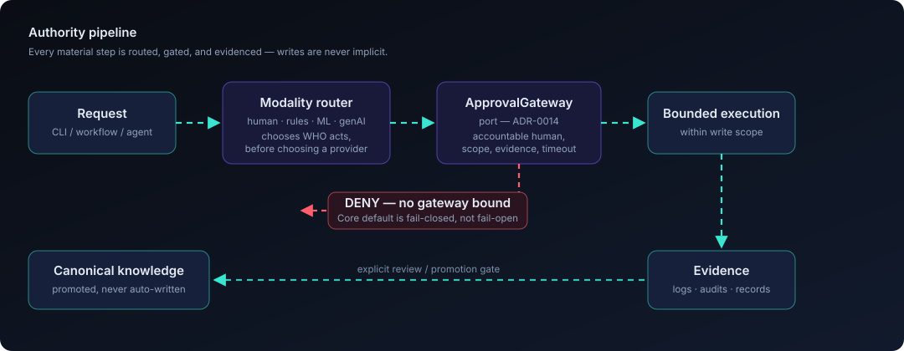

<p align="center">
  
</p>

<p align="center">
  <a href="https://github.com/chasedndt/ChaseOS-Core/actions/workflows/tests.yml"></a>
  <a href="LICENSE.md"></a>
  <a href="https://www.python.org/downloads/"></a>
  <a href="ROADMAP.md"></a>
  <a href="ruff.toml"></a>
  <a href="https://pypi.org/project/chaseos-core/"></a>
</p>

ChaseOS Core is an MIT-licensed, local-first framework for building governed hybrid-intelligence operating systems. It gives fork owners a safe scaffold for memory, projects, source intake, runtime boundaries, approval-gated automation, agent coordination, and evidence-first writeback across humans, deterministic software, ML, and generative agents.

Core is the public framework layer. Your private identity, projects, logs, credentials, provider state, and live runtime memory belong in a separate private ChaseOS instance.

## Why ChaseOS Core

Most agent frameworks optimize for capability. Core optimizes for **authority** — what an
automated system is *allowed* to do, who is accountable for it, and what evidence exists
afterward. That shows up as three concrete defaults:

- **Fail-closed, not fail-open.** Adapters without a bound backend deny rather than proceed.
  Provider connections start `read_only`; writes and external egress are approval-gated.
- **Modality before provider.** The Autonomous Operator Runtime decides whether a step
  belongs to a human, deterministic code, an ML model, or a generative agent *before* it
  picks a runtime — and can derive the approval plan without executing anything.
- **Truth is promoted, not written.** Captures land in quarantine; canonical knowledge is
  reached through an explicit review gate, not direct agent writeback.

<p align="center">
  
</p>

If you're evaluating the design, start with [`docs/ARCHITECTURE.md`](docs/ARCHITECTURE.md).

## Documentation

| Doc | What it covers |
|---|---|
| **[Concepts — start here](docs/concepts/)** | **The 10 concepts in order, and what to defer** |
| [Glossary](docs/concepts/Glossary.md) | Every ChaseOS term defined in one place |
| [Architecture](docs/ARCHITECTURE.md) | Layer model, module map, decision-routing and connections flows (diagrams) |
| [Decision records (ADRs)](docs/adr/) | Why the architecture is shaped the way it is |
| [Quickstart](docs/getting-started/Quickstart.md) | Fork-first setup path |
| [Command Reference](docs/cli/Command-Reference.md) | Full CLI surface |
| [Permission Matrix](kernel/PERMISSION_MATRIX.md) | Trust tiers and authority ceilings |
| [Approval Center](docs/governance/Approval-Center.md) | Approval-gated write governance |
| [FORKING.md](FORKING.md) | What to keep standard vs. customize in a fork |
| [CONTRIBUTING.md](CONTRIBUTING.md) | Dev setup, scope rules, PR expectations |
| [Releasing](docs/RELEASING.md) | PyPI setup and how a release is cut |
| [examples/](examples/) | Runnable scripts: use Core as a library in your own project |
| [CHANGELOG.md](CHANGELOG.md) | Release history |

## What Works Today

| Area | Current Core capability | Boundary |
|---|---|---|
| Repository framework | Public folder structure, governance docs, templates, SOPs, runtime standards, and example files | Examples are scaffolds; private content is not included |
| Lean Core CLI | `chaseos version`, `chaseos doctor`, `chaseos capture`, `chaseos schedule`, `chaseos run`, `chaseos connections`, `chaseos commerce` | The Core CLI is intentionally smaller than any private/proprietary operator CLI |
| Health checks | `chaseos doctor --vault-root . --json` validates importable Core runtime blocks and the vault root shape | Checks for vault markers (`00_HOME/`, `.chaseos/`) and reports which matched; it does not validate private provider accounts or credentials |
| Capture intake | Explicit `file`, `stdin`, and optional local `image-text` capture into quarantine/intake paths | No ambient screen capture, browser-profile capture, cloud OCR, or canonical promotion by default |
| Connections registry | Local-first provider manifest discovery plus SQLite registry initialization/seeding | Does not authenticate providers, fetch private data, or send messages by default |
| Bounded workflow runner | `chaseos run <workflow_id> --dry-run` routes through the AOR/workflow substrate | **Core ships no workflow manifests**, so this resolves to `escalated` rather than executing. Running real workflows requires supplying your own registry — see [ROADMAP.md](ROADMAP.md) |
| Decision-route inspection | `chaseos decision-route inspect <contract.json> --json` deterministically checks human/rules/ML/genAI step selection and derives a decision-scoped approval plan | Inspection only: no dispatch, approval consumption, permission change, credential access, or canonical writeback |
| Schedules | Native schedule-intent listing | Core does not ship private schedules or live operator queues |
| Read-only commercial foundation | Catalog, entitlement, flags, admin overview, and ledger surfaces | Intended as product/marketplace scaffolding; not production billing by itself |
| Runtime governance | Permission matrix, trust tiers, adapter standards, Gate interface, task routing, role-card patterns | Governance docs and code are framework-level; private deployment policy belongs outside public Core |
| Repo-safe secret audit | `runtime.repo_secret_audit` can scan tracked/untracked repo text without emitting raw secret values | It is a safety check, not a substitute for manual review before publishing |

## AOR and Approval Preflight

The Autonomous Operator Runtime is not agent-only orchestration. Its expanded contract selects the appropriate modality for each material step before runtime/provider selection:

- **human** for accountability, ambiguity, liability, and protected decisions;
- **rules/code** for exact, stable, security-sensitive, or authority-bearing operations;
- **ML/statistics** for versioned prediction over structured historical data;
- **generative AI** for bounded interpretation, synthesis, language, and flexible planning.

The first Core foothold is a fail-closed, read-only Decision Modality Router:

```bash
chaseos decision-route inspect docs/runtime/Decision-Contract.example.json --json
```

It validates the route and produces an approval plan naming the accountable human, exact decision scope, reasons, required evidence, and block-on-timeout/denial behavior. It does **not** execute the route. See [`06_AGENTS/Autonomous-Operator-Runtime.md`](06_AGENTS/Autonomous-Operator-Runtime.md) and [`docs/governance/Approval-Center.md`](docs/governance/Approval-Center.md).

## Scaffold / Experimental Surfaces

These surfaces are present as Core-safe scaffolds or bounded footholds. Treat them as building blocks, not fully enabled production integrations:

- provider manifests for Discord, Telegram, Slack, WhatsApp Business Cloud, WhatsApp personal lab, iMessage Mac, GitHub, and local files;
- Studio product-surface contracts and launch references for apps built above Core;
- adapter manifests and runtime profile examples for external agent runtimes;
- acquisition/source-pack, graph, memory, subagent, OSRIL, operator-surface, and AOR modules;
- optional browser and voice extras declared in `pyproject.toml`.

## What This Repository Contains

- Framework documentation for the ChaseOS control plane.
- Templates for notes, projects, logs, runtime profiles, approvals, and audits.
- Governance patterns for approval-gated writes and evidence-first promotion.
- Adapter standards for external runtimes and model/tool surfaces.
- Example folders that can be copied into a private deployment.
- The lean MIT Core CLI entrypoint: `chaseos = runtime.cli.core_main:main`.
- Local-first runtime modules for capture, schedules, connections, commerce scaffolding, AOR, Gate interfaces, graph/memory inspection, and bounded operator surfaces.
- Studio product-surface contracts for the application layer built above Core.

## What This Repository Intentionally Does Not Contain

- Personal notes or private project state.
- Live runtime logs, approval queues, agent-bus state, or private schedules.
- Credential values, API keys, tokens, private keys, or provider secrets.
- Provider-specific deployment state or authenticated account bindings.
- Machine-local paths or operator-specific usernames.
- Proprietary/private Studio builds or packaged installers.
- Public write authority to canonical knowledge without review/promotion.

## Intended Use

Use Core as a starter kit and reference model. Private deployments should keep local content, runtime state, and operator records outside the public Core tree.

A healthy fork should:

1. keep `chaseos-core` as framework/source;
2. create a separate private ChaseOS instance for personal or business operations;
3. copy templates and examples into that private instance only when needed;
4. store credentials in ignored local stores or external secret managers;
5. run read-only/dry-run checks before enabling write, connector, browser, or publication actions;
6. promote durable truth through an explicit review gate instead of direct agent writeback.

ChaseOS Studio should be treated as an application layer over these Core contracts. Ship public contracts and reviewed source-safe docs in the repo; distribute packaged installers such as `.exe` files through release channels rather than normal source commits.

## Use Core in your own project

You do **not** have to fork Core to use its governance primitives. Install it as a
dependency and import what you need — the modality router, the Gate port, and manifest
loading all work as plain library calls with no vault directory:

```bash
pip install chaseos-core
```

```python
from runtime.gate_interface import check_runtime_operation, register_gate

# With no provider registered, Core denies by default — it never silently permits.
allowed, reason = check_runtime_operation("vault.write")
assert allowed is False

class MyPolicy:
    def check_runtime_operation(self, operation, **kwargs):
        return operation.endswith(".read"), f"policy decision for {operation}"
    # ... plus the remaining GateProvider methods

register_gate(MyPolicy())
```

Runnable scripts for the three main entry points are in [`examples/`](examples/), and
[`examples/README.md`](examples/README.md) documents which parts of Core need a vault root
and which do not.

## Quickstart

See [`docs/getting-started/Quickstart.md`](docs/getting-started/Quickstart.md) for the fork-first setup path.

Minimal validation commands:

```bash
python -m venv .venv
source .venv/bin/activate  # Windows PowerShell: .venv\Scripts\Activate.ps1
pip install -e .
chaseos version
chaseos doctor --vault-root . --json
chaseos connections providers --json
```

Run a repo-safe secret audit before publishing a fork:

```bash
python - <<'PY'
from runtime.repo_secret_audit import audit_repo_secrets, format_repo_secret_audit
print(format_repo_secret_audit(audit_repo_secrets('.')))
PY
```

## Contributing

Contributions are welcome. See [`CONTRIBUTING.md`](CONTRIBUTING.md) for dev setup, scope
rules (what belongs in Core versus a private instance), and PR expectations. This project
follows the [Contributor Covenant](CODE_OF_CONDUCT.md).

Security issues should not be filed as public issues — see [`SECURITY.md`](SECURITY.md).

## License

ChaseOS Core is released under the MIT License. See [`LICENSE.md`](LICENSE.md).
Third-party dependency notices are recorded in
[`THIRD_PARTY_NOTICES.md`](THIRD_PARTY_NOTICES.md).
