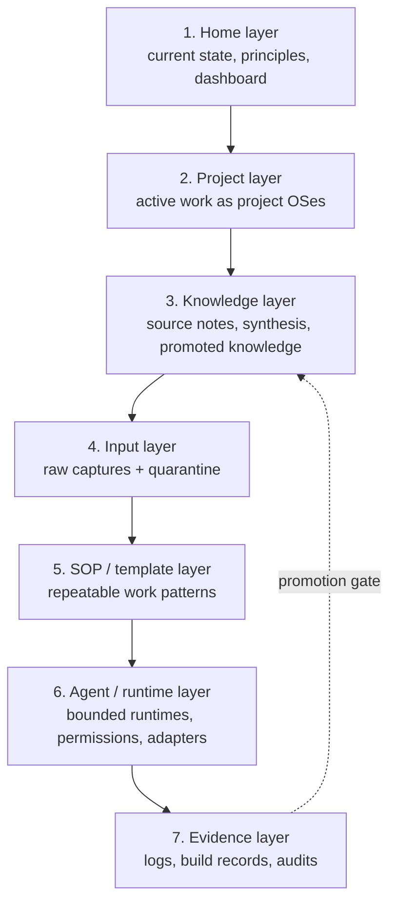
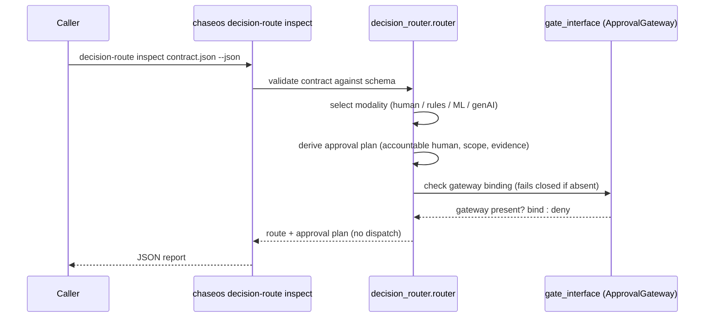
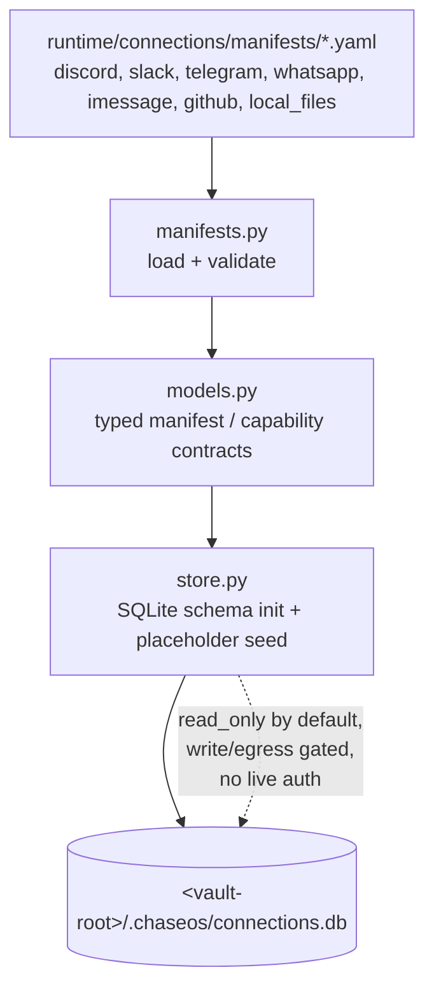

# ChaseOS Core — Architecture

This is the public architecture map for ChaseOS Core: the canonical layers, how a request
moves through the runtime, and where the boundary sits between Core (this repo) and a
private ChaseOS instance built on top of it.

For the decisions *behind* this architecture — and the trade-offs accepted — see the
[Architecture Decision Records](adr/).

## Authority Pipeline

The single idea the rest of the architecture serves: nothing material happens without a
named modality, an approval decision, a bounded write scope, and a record.

<p align="center">
  
</p>

## Canonical Layers

Core organizes a local-first human-AI system into seven layers (see
[`docs/concepts/Core-Operating-Model.md`](concepts/Core-Operating-Model.md) for the prose
version of this model):



Untrusted input never reaches the Knowledge layer directly — it passes through Input
(quarantine) and an explicit review/promotion gate before it becomes canonical truth.

## Module Map

```mermaid
flowchart LR
    subgraph CLI["runtime/cli"]
        core_main["core_main.py<br/>chaseos / chase entrypoint"]
    end

    subgraph Runtime["runtime/*"]
        aor["aor/<br/>Autonomous Operator Runtime<br/>engine, registry, role cards, task router"]
        decision["decision_router/<br/>modality routing + approval-plan derivation"]
        connections["connections/<br/>provider manifests + local registry"]
        capture["capture/<br/>intake, quarantine, visual_capture"]
        operator["operator_surface/<br/>bounded browser + approvals"]
        graph["graph/<br/>structural graph, query, artifact model"]
        memory["memory/<br/>read-only runtime memory inspection"]
        gate["gate_interface.py<br/>ApprovalGateway port (ADR-0014)"]
        policy["policy/<br/>gateway allowlists"]
        subagents["subagents/<br/>approval packets, coordination"]
    end

    subgraph Kernel["kernel/"]
        matrix["PERMISSION_MATRIX.md<br/>trust tiers"]
    end

    subgraph External["Private instance (not in Core)"]
        priv["credentials, live queues,<br/>personal vault, provider auth"]
    end

    core_main --> aor
    core_main --> decision
    core_main --> connections
    core_main --> capture
    aor --> gate
    aor --> subagents
    decision --> gate
    connections --> policy
    operator --> gate
    gate -.fails closed without.-> priv
    matrix -.governs.-> aor
    matrix -.governs.-> connections
    matrix -.governs.-> operator
```

Core ships the framework, contracts, and fail-closed adapters. A private instance supplies
the credentials and live state the dotted edge above intentionally does not include.

## Decision Modality Routing

The Autonomous Operator Runtime (AOR) selects a modality — human, rules/code, ML, or
generative AI — for each material step before choosing a runtime or provider. The Core
foothold for this is read-only inspection, not execution:



Inspection never dispatches the route, consumes an approval, or performs a canonical write.

## Connections Registry Flow



Every provider manifest defaults to `read_only`; write and external-egress capabilities are
approval-gated and disabled until a private instance explicitly enables them.

## Runtime Topology

Core sits above the runtimes that do the work. Each declares a profile, proposes by
default, and passes work inward as task packets — and every packet crosses the same
authority boundary.

<p align="center">
  
</p>

See [Multi-Runtime Coordination](concepts/Multi-Runtime-Coordination.md) for the contracts
and the handoff rules.

## Core vs. Private Instance

| | ChaseOS Core (this repo) | Private ChaseOS instance |
|---|---|---|
| Contains | Framework, contracts, governance docs, fail-closed adapters, lean CLI | Credentials, live runtime state, personal vault, provider auth |
| Write authority | None by default (approval-gated, fails closed) | Configured per-deployment |
| Distribution | MIT source, public repo | Private, never committed to Core |
| Extension point | `gate_interface.ApprovalGateway`, connection manifests, workflow registry | Binds a real backend behind those ports |

See [`FORKING.md`](../FORKING.md) for the practical guide to keeping this split when you
fork Core, and [`CORE_MANIFEST.md`](../CORE_MANIFEST.md) for the publication standard that
keeps private state out of this tree.

The dotted "fails closed without" edge in the module map is the decision recorded in
[ADR-0014](adr/ADR-0014-core-gate-interface.md); the workflow-tier split that keeps private
workflows out of this repo is [ADR-0015](adr/ADR-0015-aor-workflow-handler-registry.md).
